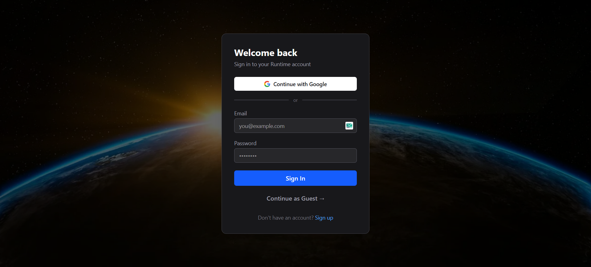
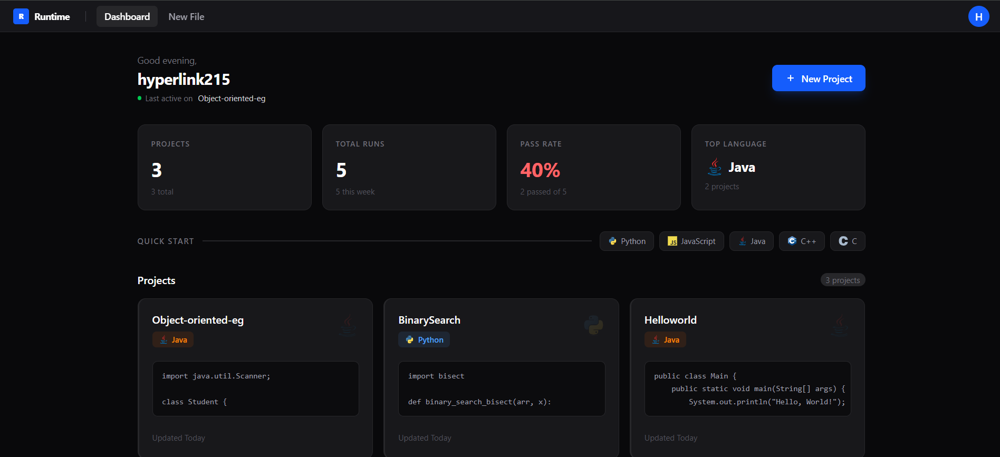
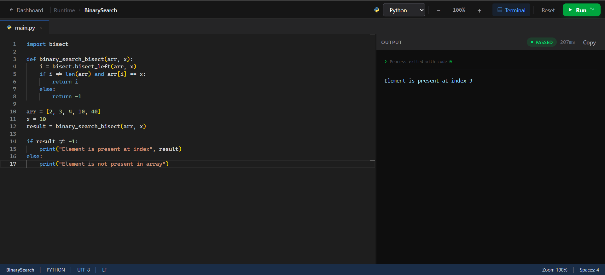
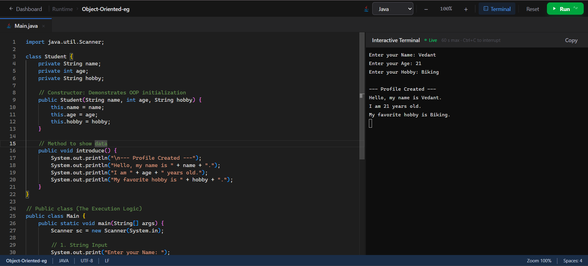
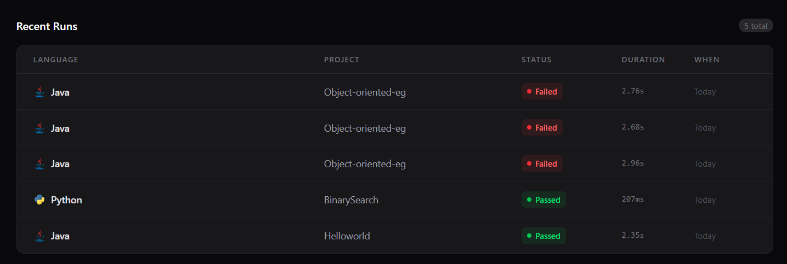
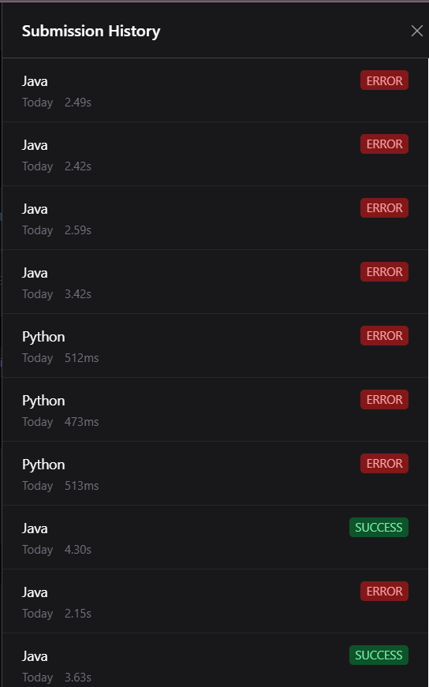
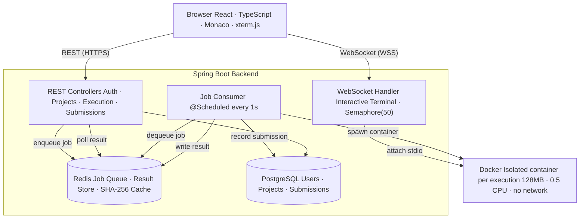

# Runtime — Cloud Code Execution Platform

Runtime is a full-stack cloud-based code execution platform that allows users to write, run, and manage code across multiple programming languages directly in the browser. It supports both instant HTTP-based execution and fully interactive terminal sessions with live stdin/stdout streaming — all executed inside isolated Docker containers on a remote server.

Live deployment: [runtime-engine.tech](https://www.runtime-engine.tech)

---

## Screenshots

**Login**


**Dashboard**


**Code Editor with Output**


**Interactive Terminal**


**Recent Runs**


**Submission History**


---

## Features

**Code Execution**
- Execute code in Java, Python, C, C++, and JavaScript
- Sandboxed Docker containers per execution with strict resource limits (128 MB RAM, 0.5 CPU, no network, PID cap)
- Asynchronous job queue via Redis — requests are queued and processed by a background worker, enabling concurrent execution without thread blocking
- SHA-256 content-addressed result caching — identical code + language + stdin combinations return instantly without spawning a new container (1-hour TTL)
- Real-time execution status updates (queued, running, completed) via frontend polling

**Interactive Terminal**
- Full-duplex WebSocket sessions for programs that require live stdin input (e.g. `Scanner`, `input()`, `cin`)
- Raw bidirectional pipe to container stdio — characters are streamed as typed, not line-buffered
- xterm.js terminal emulator in the browser with full ANSI color support
- Concurrent session cap (50 simultaneous WebSocket connections) with automatic resource cleanup on disconnect

**Authentication & Projects**
- Email/password registration with JWT-based stateless authentication (24-hour expiry)
- Google OAuth2 login via Spring Security
- Project management — create, rename, and auto-save code and language selection per project
- Full submission history per user with language, timestamp, exit code, and output stored in PostgreSQL

**Editor**
- Monaco Editor (the engine powering VS Code) with syntax highlighting for all supported languages
- IntelliJ-style code snippets — `sout` expands to `System.out.println()`, `fori` to a for loop, `cout`/`cin` for C++, list comprehensions for Python, and more
- Draggable split-pane layout between editor and output panel
- Zoom controls, language selector, and Ctrl+Enter to run

---

## Architecture



---

## Tech Stack

| Layer | Technology |
|---|---|
| Backend | Java 21, Spring Boot, Spring Security |
| Auth | JWT, Google OAuth2 |
| Execution | Docker (docker-java), ProcessBuilder |
| Queue / Cache | Redis |
| Database | PostgreSQL, Spring Data JPA, Hibernate |
| WebSockets | Spring WebSocket |
| Frontend | React 19, TypeScript, Vite |
| Editor | Monaco Editor |
| Terminal | xterm.js |
| Deployment | DigitalOcean (backend), Vercel (frontend), Nginx |

---

## Local Setup

### Prerequisites

- Java 21
- Maven
- Node.js 18+
- Docker (running)
- PostgreSQL
- Redis

### Backend

```bash
cd backend

# Copy and fill in environment variables (see below)
cp src/main/resources/application.properties application.properties

./mvnw spring-boot:run
```

The API starts on `http://localhost:8081`.

### Frontend

```bash
cd frontend
npm install
npm run dev
```

The frontend starts on `http://localhost:5173`.

---

## Environment Variables

### Backend (`application.properties` or environment)

| Variable | Description | Default |
|---|---|---|
| `PORT` | Server port | `8081` |
| `DB_URL` | PostgreSQL JDBC URL | `jdbc:postgresql://localhost:5432/runtimedb` |
| `DB_USERNAME` | PostgreSQL username | `postgres` |
| `DB_PASSWORD` | PostgreSQL password | `root` |
| `REDIS_HOST` | Redis host | `localhost` |
| `REDIS_PORT` | Redis port | `6379` |
| `REDIS_ENABLED` | Enable Redis queue/cache | `true` |
| `DOCKER_SOCKET` | Docker socket path | `unix:///var/run/docker.sock` |
| `JWT_SECRET` | JWT signing secret | *(set a strong random value in production)* |
| `JWT_EXPIRATION` | JWT TTL in milliseconds | `86400000` (24h) |
| `GOOGLE_CLIENT_ID` | Google OAuth2 client ID | — |
| `GOOGLE_CLIENT_SECRET` | Google OAuth2 client secret | — |
| `ALLOWED_ORIGINS` | CORS allowed origins | `http://localhost:5173` |
| `FRONTEND_URL` | Frontend base URL (OAuth redirect) | `http://localhost:5173` |

### Frontend (`.env`)

```env
VITE_API_BASE_URL=http://localhost:8081
```

---

## API Overview

### Auth
| Method | Endpoint | Description |
|---|---|---|
| POST | `/api/auth/register` | Register with email + password |
| POST | `/api/auth/login` | Login, returns JWT |
| GET | `/oauth2/authorization/google` | Initiate Google OAuth2 |

### Execution
| Method | Endpoint | Description |
|---|---|---|
| POST | `/api/execute` | Submit code, returns `jobId` |
| GET | `/api/result/{jobId}` | Poll job result |

### Projects
| Method | Endpoint | Description |
|---|---|---|
| GET | `/api/projects` | List user's projects |
| POST | `/api/projects` | Create project |
| PUT | `/api/projects/{id}` | Update project (code, language, title) |
| DELETE | `/api/projects/{id}` | Delete project |

### Submissions
| Method | Endpoint | Description |
|---|---|---|
| GET | `/api/submissions` | Get user's submission history |

### WebSocket
| Endpoint | Description |
|---|---|
| `ws://{host}/ws/execute` | Interactive terminal session |

Send initial JSON payload: `{ "language": "python", "code": "..." }`. After that, raw stdin characters are streamed directly to the container.

---

## Security

- All user-submitted code runs inside an isolated Docker container with no network access, a read-only root filesystem option, memory and CPU hard limits, and a PID limit to prevent fork bombs
- A blocklist scanner rejects code containing patterns like `rm -rf`, `curl`, `wget`, `sudo`, `mkfs`, and `/etc/passwd` before execution begins
- JWT tokens are validated on every protected request via a servlet filter
- CORS is restricted to configured origins only
- Passwords are stored hashed (BCrypt via Spring Security)

---

## Deployment Notes

The backend is deployed as a JAR on a DigitalOcean Droplet behind Nginx (reverse proxy). The Docker socket is bind-mounted into the process environment so the JVM can communicate with the host Docker daemon. Redis and PostgreSQL run on the same server.

The frontend is deployed on Vercel with `VITE_API_BASE_URL` pointing to the backend domain.

```nginx
location /api/ {
    proxy_pass http://localhost:8081;
    proxy_set_header Host $host;
}

location /ws/ {
    proxy_pass http://localhost:8081;
    proxy_http_version 1.1;
    proxy_set_header Upgrade $http_upgrade;
    proxy_set_header Connection "Upgrade";
}
```

---

## Project Structure

```
Runtime/
├── backend/
│   └── src/main/java/com/runtime/
│       ├── config/          # Security, JWT, Redis, Docker, WebSocket config
│       ├── controller/      # REST controllers (auth, execution, projects, submissions)
│       ├── engine/          # Docker execution engine + interactive session handler
│       ├── jobs/            # Redis job producer and consumer (async worker)
│       ├── model/           # JPA entities and DTOs
│       ├── repository/      # Spring Data JPA repositories
│       ├── security/        # OAuth2 success handler
│       ├── service/         # Business logic (execution, projects, submissions, auth)
│       └── websocket/       # WebSocket handler with semaphore concurrency control
└── frontend/
    └── src/
        ├── api/             # Axios API clients
        ├── components/      # Editor, terminal, dashboard, navbar, common UI
        ├── context/         # Auth context
        ├── hooks/           # useCodeExecution, useProjects, useAuth, etc.
        ├── pages/           # EditorPage, DashboardPage, LoginPage, SignupPage
        ├── types/           # TypeScript interfaces
        └── utils/           # Output formatting, language maps
```
